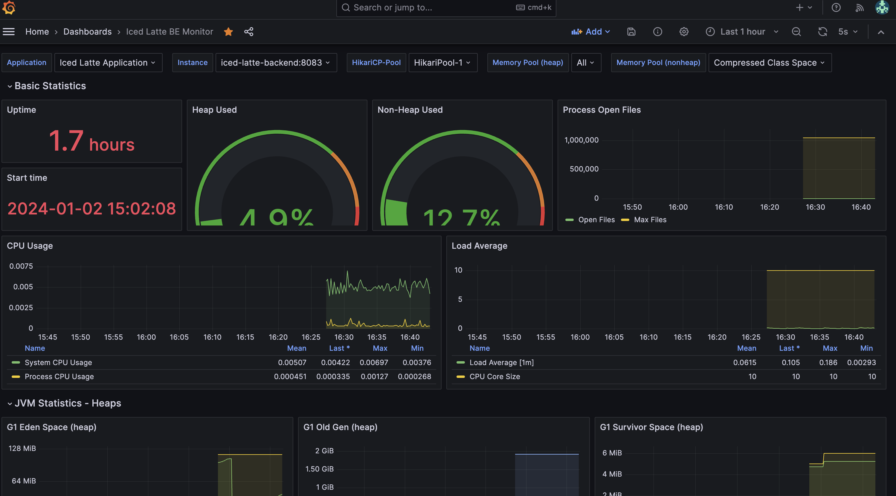
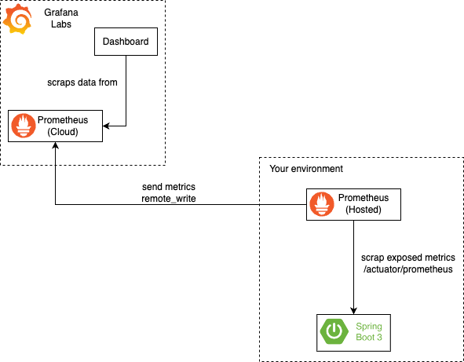
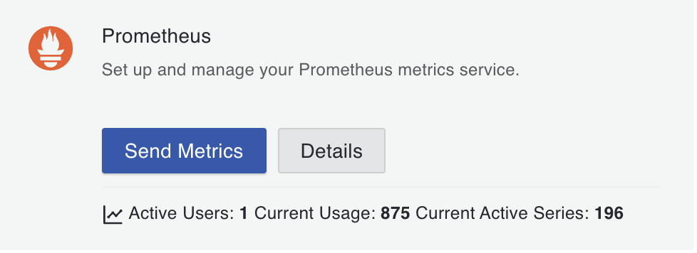
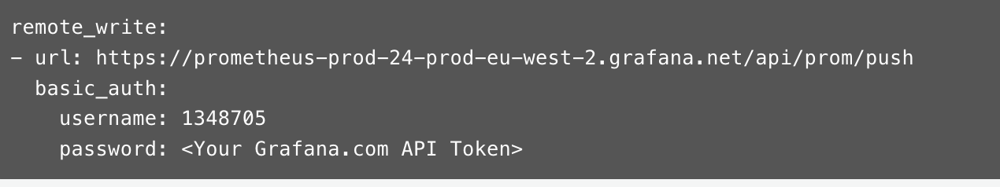
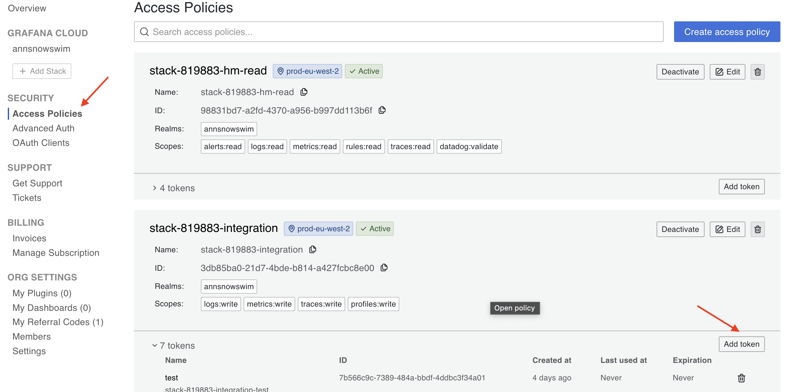
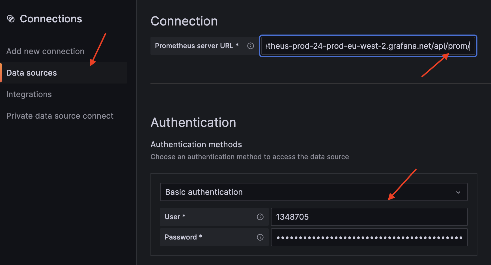

# Grafana Labs and Prometheus Monitoring for Spring Boot 3

Tech Stack:

* Spring Boot 3 Application with Actuator
* Hosted Prometheus
* Grafana Cloud (Cloud Prometheus + Visualization Dashboard)

## Expected Result

Monitoring visualization on https://grafana.com/:



## Infrastructure Schema



## Settings

1. Log in to your Grafana Labs account
2. At Stack Management Panel click _Send Metrics_
   
3. Copy `remote_write` configuration to `prometheus.yaml` located at your environment
   
4. Generate **write** token: on the left side navigate to **Security** > **Access Policies** and add token with _write_ permission
   
5. Copy the token to `prometheus.yaml` located at your environment
6. Generate **read** token in the same manner, save it for later use
7. Add new datasource: 
   * navigate to your Grafana instance > **Connections** > **Data sources**
   * click _Add new data source_ > select _Prometheus_
   * copy url from `remote_write` configuration to _Prometheus server URL_, remove `/push` ending, i.e. the URL should be like
     ```yaml
     https://prometheus-prod-24-prod-eu-west-2.grafana.net/api/prom
     ```
   * specify _Basic Authentication_: copy `username` from `remote_write` and specify **read** token
     
   * click _Save & test_: connection should be successful
8. New datasource is ready for visualisation! Ready-to-use solutions:
   * [Iced Latte BE dashboard](dashboard.json)
   * [Spring Boot 2.1 System Monitor](https://grafana.com/grafana/dashboards/11378-justai-system-monitor/)

## Resources

* [Monitoring Made Simple: Empowering Spring Boot Applications with Prometheus and Grafana](https://medium.com/simform-engineering/revolutionize-monitoring-empowering-spring-boot-applications-with-prometheus-and-grafana-e99c5c7248cf)