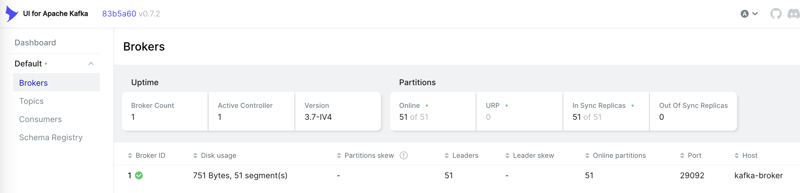

# Local Kafka Docker Sandbox

Prerequisites:

* [Docker](https://www.docker.com/)
* cURL

## Expected Result

Local Kafka sandbox for learning purposes with ability to:

1. access [Kafka UI](http://localhost:8098/)
    
2. register topic using `curl`
3. register schema using `curl`
4. produce message corresponding to schema using `curl`
5. consume message corresponding to schema using `curl`

## Steps

1. Start containers

    ```bash
    docker compose up -d 
    ```
    Check [Kafka UI](http://localhost:8098/) is available.

2. Register topic `test_topic`
   * get cluster id
        ```bash
        curl -X GET "http://localhost:8082/v3/clusters"
        ```
   * create topic: copy `cluster_id` from the previous response
        ```bash
        curl -X POST -H "Content-Type: application/json" \
             --data-raw '{
                            "topic_name": "test_topic"
                         }' \
             "http://localhost:8082/v3/clusters/{cluster_id}/topics"
        ```
3. Register JSON schema for topic `test_topic`: note that the schema is a string, thus escape quotes in the JSON object
   * for key
        ```bash
        curl -X POST -H "Content-Type: application/vnd.schemaregistry.v1+json" \
             --data-raw '{
                            "schemaType": "JSON",
                            "schema": "{\"userId\":\"long\"}"
                         }' \
             "http://localhost:8081/subjects/test_topic-key/versions"
        ```
   * for value
        ```bash
        curl -X POST -H "Content-Type: application/vnd.schemaregistry.v1+json" \
             --data-raw '{
                            "schemaType": "JSON",
                            "schema": "{\"text\":\"string\"}"
                         }' \
              "http://localhost:8081/subjects/test_topic-value/versions"
        ```
    Expected output:

      ```json
      { "id": 1 }
      ```

4. Produce message to `test_topic`: copy `id`s from the previous responses 

    ```bash
    curl -v -X POST -H "Content-Type: application/vnd.kafka.jsonschema.v2+json" \
         --data-raw '{
                        "key_schema_id": {key_schema_id},
                        "value_schema_id": {value_schema_id},
                        "records": [
                          {
                            "key": {
                              "userId": 12345
                            },
                            "value": {
                              "text": "Kafka Learner"
                            }
                          }
                        ]
                     }' \
         "http://localhost:8082/topics/test_topic"
    ```
    Expected output:

    ```json
    {
      "offsets": [
        {
            "partition": 0,
            "offset": 0,
            "error_code": null,
            "error": null
        }
      ],
      "key_schema_id": 1,
      "value_schema_id": 2
    }
    ```
5. Consume message from `test_topic`
   * create consumer `test_consumer`: pay attention to `format`, it should be `jsonschema`
     ```bash
     curl -X POST -H "Content-Type: application/vnd.kafka.json.v2+json" \
          --data-raw '{
                "name": "test_consumer",
                "format": "jsonschema",
                "auto.offset.reset": "earliest",
                "auto.commit.enable": "true"
          }' \
     "http://localhost:8082/consumers/test_consumer_group"
     ```
   * subscribe to the topic
     ```bash
     curl -X POST -H "Content-Type: application/vnd.kafka.json.v2+json" \
          --data '{"topics":["test_topic"]}' \
          "http://localhost:8082/consumers/test_consumer_group/instances/test_consumer/subscription"
     ```
   * consume message
     ```bash
     curl -v -H "Accept: application/vnd.kafka.jsonschema.v2+json" \
          "http://localhost:8082/consumers/test_consumer_group/instances/test_consumer/records"
     ```
     Expected output:
     ```json
     [
       {
         "topic": "test_topic",
         "key": {
           "userId": 12345
         },
         "value": {
           "text": "Kafka Learner"
         },
         "partition": 0,
         "offset": 0
       }
     ]
     ```
   * close the consumer (to make it leave the group and clean up its resources)
     ```bash
     curl -X DELETE -H "Content-Type: application/vnd.kafka.v2+json" \
          "http://localhost:8082/consumers/test_consumer_group/instances/test_consumer"
     ```

## Links

* [Confluent REST Proxy for Apache Kafka](https://docs.confluent.io/platform/current/kafka-rest/index.html)
* [REST Proxy tutorial](https://developer.confluent.io/get-started/rest/)
* [Schema Registry API Reference](https://docs.confluent.io/platform/current/schema-registry/develop/api.html)

## Ducking Traps

Issues that you might encounter:

1. Problem: error on attempt to consume message using Kafka Rest Proxy
    ```json
    {"error_code":40801,"message":"java.io.CharConversionException: Invalid UTF-32 character..."}
    ```
   _Solution_: change `"format": "json"` to `"format": "jsonschema"` when create a consumer `/consumers/test_consumer_group`
2. Problem: getting empty `[]` on the 1st consume
   _Solution_: either run consume twice ([kafka-rest/issues/432](https://github.com/confluentinc/kafka-rest/issues/432)) or use `KAFKA_GROUP_INITIAL_REBALANCE_DELAY_MS: 0`
3. Problem: error on attempt to register schema
    ```json
    {"error_code":400,"message":"Cannot deserialize value of type `String` from Object value (token `JsonToken.START_OBJECT`)"}
    ```
   _Solution_: schema is a string, not an object, therefore change `"schema": {"text":"string"}` to `"schema": "{\"text\":\"string\"}"`