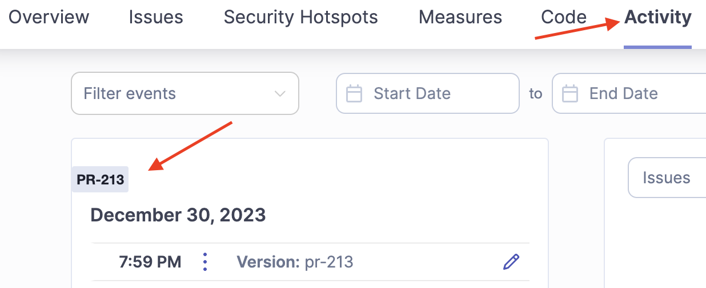
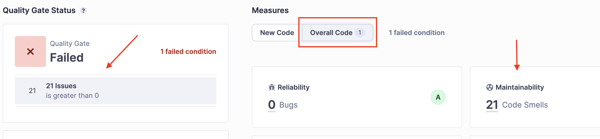
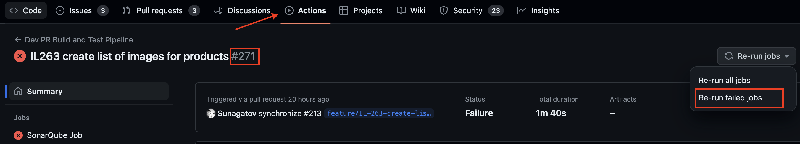
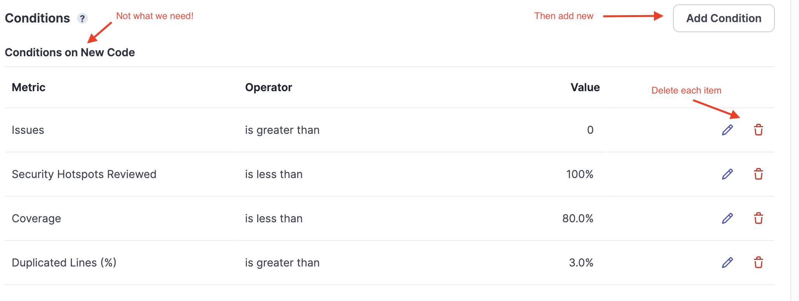
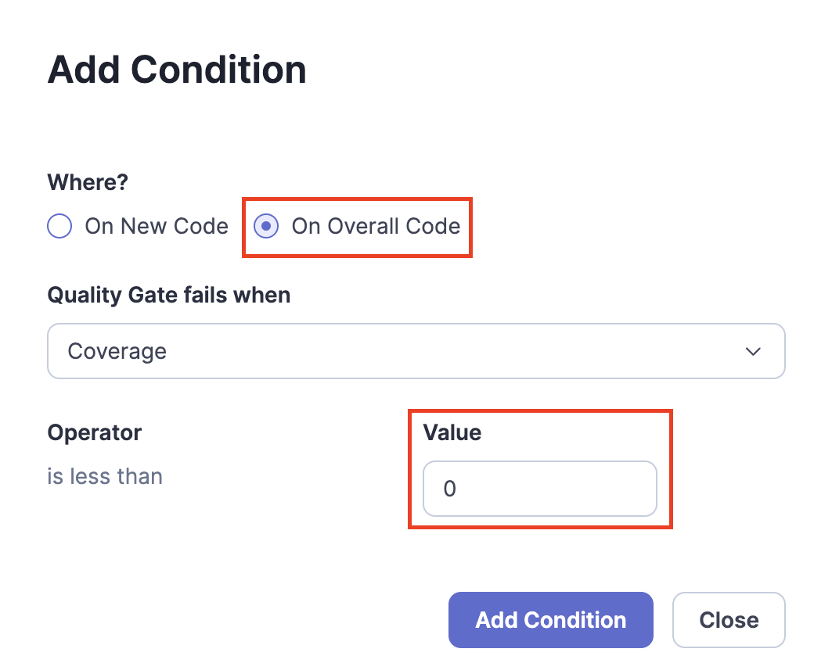

# SonarQube CE + GitHub Actions for open source project

Applicable for SQ CE server `10.3.0.82913`.

## Expected Result

Considering absence of branch analysis for Community Edition version, expected pipeline is a bit odd and requires time to get used to:

1. developer creates PR / pushes changes to existing PR
2. SQ analysis is triggered
3. If analysis fails, developer navigates to SQ server:
   *  checks project's **Activity** tab and the latest tag `PR-number` > number should be equal to the opened PR
      
   * if PR number is correct, developer navigates to **Overview** > **Overall Code** and reviews issues
      
   * if PR number differs, developer navigates to GitHub and re-runs pipeline (**Actions** > PR > **Re-run jobs** > **Re-run failed jobs**)
      
## SonarQube Server Settings

### Start Server

1. On Linux edit `/etc/sysctl.conf` and set `vm.max_map_count` to `262144` to prevent Elasticsearch failure (refer to [SO answer](https://stackoverflow.com/a/51448773/8165307))
2. Start Postgres and SonarQube using [docker compose file](examples/docker-compose.yaml)

### Quality Gates

Built-in QG is not suitable, because it's supposed to be applied to `New Code`, but Community Edition has limited options to set this up.

1. Log in to SQ server as admin
2. Go to **Quality Gates**, click **Create**
3. Scroll down > **Unlock Editing**
4. Remove all conditions as they are _Conditions on New Code_
5. Click **Add Condition**
    

6. For each metric `Issues`, `Security Hotspots Reviewed`, `Coverage`, `Duplicated Lines (%)`:
   * add `Value`
   * select `On Overall Code`
   

## GitHub Action Pipeline

### JS/TS project

1. Use official [sonarqube-scan-action@master](https://github.com/SonarSource/sonarqube-scan-action) (refer to [example](examples/github-js-pipeline.yaml))
   * add `projectVersion` arg
   
   ```yaml
    with:
      args: >
      -Dsonar.projectVersion=pr-${{ github.event.pull_request.number }}`
   ```
   * add QG check (refer to [example](examples/github-js-pipeline.yaml))
   ```yaml
   - name: SonarQube Quality Gate check
     uses: sonarsource/sonarqube-quality-gate-action@master
     timeout-minutes: 5
     env:
          SONAR_TOKEN: ${{ secrets.SONAR_TOKEN }}
          SONAR_HOST_URL: ${{ secrets.SONAR_HOST_URL }}
   ```

2.  Add test coverage step before SQ analysis (refer to [example](examples/github-js-pipeline.yaml))
   ```yaml
   - name: Test and Coverage
     run: npm run test --coverage
   ```
3. Install [jest-sonar](https://www.npmjs.com/package/jest-sonar) and add coverage settings to `jest.config.js`:
   ```ts
     reporters: ['default',  ['jest-sonar', { outputName: 'jest-sonar-coverage-report.xml'}]],
     collectCoverage: true,
     coverageReporters: ['lcov', 'clover'],
   ```
4. Navigate to SQ server and create local **project**
5. Add `sonar-project.properties` to the root of repository:
   ```properties
   sonar.projectKey=Iced-Latte-Frontend
   sonar.testExecutionReportPaths=coverage/jest-sonar-coverage-report.xml
   sonar.javascript.lcov.reportPaths=coverage/lcov.info
   sonar.test.inclusions=**/*.test.tsx
   sonar.sources=src
   sonar.tests=.
   ```

### Java project

1. Add SQ and JaCoCo plugins to `pom.xml`

```xml
<plugin>
   <groupId>org.sonarsource.scanner.maven</groupId>
   <artifactId>sonar-maven-plugin</artifactId>
   <version>3.10.0.2594</version>
</plugin>
<plugin>
    <groupId>org.jacoco</groupId>
    <artifactId>jacoco-maven-plugin</artifactId>
<version>0.8.11</version>
<executions>
   <execution>
      <goals>
         <goal>prepare-agent</goal>
      </goals>
   </execution>
   <execution>
      <id>report</id>
      <phase>prepare-package</phase>
      <goals>
         <goal>report</goal>
      </goals>
   </execution>
</executions>
</plugin>
```

2. Add SQ analysis step to config

```yaml
- name: SonarQube Analysis
  env:
     SONAR_TOKEN: ${{ secrets.SONAR_TOKEN }}
     SONAR_HOST_URL: ${{ secrets.SONAR_HOST_URL }}
  run: mvn -B verify -Pdev org.sonarsource.scanner.maven:sonar-maven-plugin:sonar -Dsonar.projectVersion=pr-${{ github.event.pull_request.number }} -Dsonar.coverage.jacoco.xmlReportPaths=target/site/jacoco/jacoco.xml
```

3. Add QG check to config

```yaml
      - name: SonarQube Quality Gate check
        id: sonarqube-quality-gate-check
        uses: sonarsource/sonarqube-quality-gate-action@master
        timeout-minutes: 5
        env:
          SONAR_TOKEN: ${{ secrets.SONAR_TOKEN }}
          SONAR_HOST_URL: ${{ secrets.SONAR_HOST_URL }}
        with:
          scanMetadataReportFile: target/sonar/report-task.txt
```